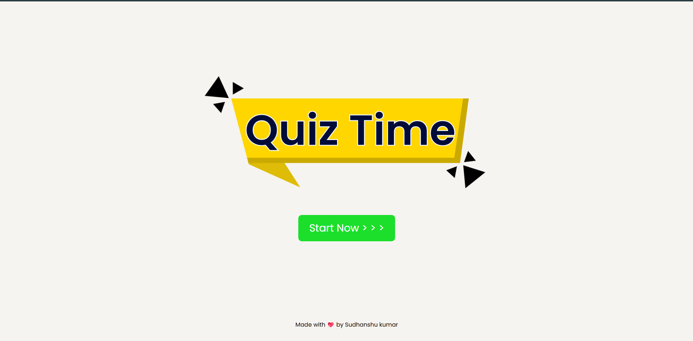

# Interactive Quiz App

A simple and interactive quiz application built using **HTML, CSS, and JavaScript**. This app allows users to answer multiple-choice questions, provides a countdown timer, tracks scores, and has sound effects that can be toggled on/off.

---

## Live Preview

Check out the live demo of the quiz app:  
[https://sudhanshuverse.github.io/quiz-app/](https://sudhanshuverse.github.io/quiz-app/)  

---

## Screenshots

*Start Screen*
 

*MCQ question Screen*
  

*Result Screen*
  


---

## Features

- Display multiple-choice questions from a JS file.
- Countdown timer with visual alerts:
  - Background and timer color change at 15 and 5 seconds remaining.
  - Automatic move to next question when time is up.
- Sound effects:
  - Click sound when selecting an option.
  - Warning sound when timer is low.
  - Sound toggle with an on/off button (plays only when `sound-on` is active).
- Track correct and incorrect answers.
- Display final score with percentage and progress bar.

---
```js
File Structure
graphql
Copy
Edit
quiz-app/
├── index.html          # Main HTML file
├── style.css           # CSS styles
├── script.js           # JavaScript logic
├── questions.js        # Quiz questions and answers
├── assets/
│   ├── sound-on.png
│   ├── sound-off.png
│   ├── click.mp3
│   └── warning.mp3
└── README.md           # This file
```
## Quiz Questions Format
questions.js exports an array of question objects like this:

```js
export const quiz = [
    {
        question: "What is the capital of France?",
        options: ["London", "Paris", "Berlin", "Rome"],
        answer: 1 // Index of the correct option
    },
    {
        question: "Which language runs in a web browser?",
        options: ["Java", "C", "Python", "JavaScript"],
        answer: 3
    }
];
```

## Technologies Used

- HTML5
- CSS3
- JavaScript (ES6 modules)

## License
This project is open source and available under the MIT License.

## Author
Sudhanshu Kumar
